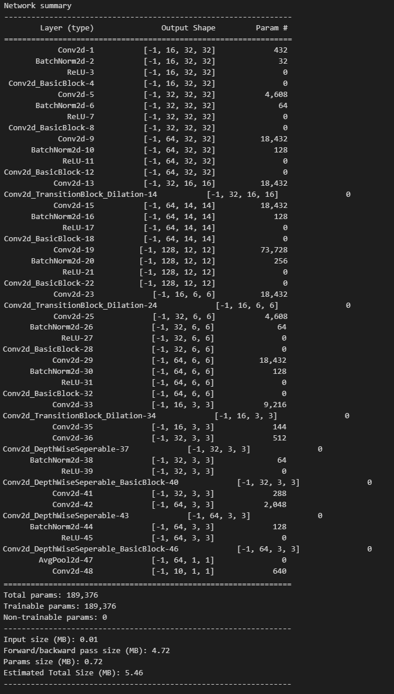

# CIFAR-10 Classification with Depthwise Separable CNN and Dilation

This repository implements a Convolutional Neural Network (CNN) architecture for CIFAR-10 image classification. The model achieves high accuracy while keeping parameters low (189,376) through:

1. Depthwise Separable Convolutions - Efficiently processes input features
2. Dilated Convolutions - Expands receptive field without increasing parameters

## Key Features

- **Dataset**: CIFAR-10
  - Preloaded using `torchvision.datasets.CIFAR10`
  - Data augmentation applied with the `albumentations` library.

- **Model Architecture**:
  - Model Architecture:
    - 4 convolutional blocks with transition layers
    - Transition layers use dilated strided convolutions (stride=2, dilation=2)
    - Depthwise separable convolutions for parameter efficiency
    - Global average pooling in output layer
    - Final receptive field: 115
    - Parameter count: 189,376
  - Model Summary <br>


- **Data Augmentation**:
  - Horizontal Flip
  - ShiftScaleRotate
  - CoarseDropout:
    - `max_holes=1`, `max_height=16px`, `max_width=16px`
    - `min_holes=1`, `min_height=16px`, `min_width=16px`
    - `fill_value=(mean of dataset)`, `mask_fill_value=None`

- **Training**:
- Attained over 85% accuracy within 35 epochs.  
- Employed a StepLR scheduler to systematically lower the learning rate at set intervals, improving overall convergence speed and stability.

- **Modular Code Design**: Organized into directories for easy extensibility and maintenance.

## Directory Structure

```
DilationDepthWiseConvolutionModel/
|-- config/
    |-- config.json
|-- data/
    |-- cifar10_dataset_loader.py
    |-- cifar10_dataset.py
    |-- data_loader.py
    |-- datasets.py
|-- models/
    |-- base_nn_network_utils.py
    |-- cifar10_dialation_dsc_noMaxpool.py
|-- training/
    |-- optimizers.py
    |-- trainer.py
|-- utils/
    |-- visualization.py
|-- cifar_main.ipynb
```

## Requirements

- Python 3.x
- PyTorch
- Albumentations
- Torchvision

## Usage

### 1. Clone the Repository
```bash
git clone https://github.com/TousifAhamed/CIFAR10.git
cd CIFAR10
```

### 2. Install Dependencies
Ensure all required libraries are installed. Use the provided `config.json` to check dependency versions.

### 3. Run the Training Script
Run `cifar_main.ipynb` to execute the training pipeline, visualize metrics, and evaluate the model.

### 4. Customize Configurations
Edit `config/config.json` to modify hyperparameters, data paths, and other settings.

## Results

The model achieves an accuracy of over **85%** on the CIFAR-10 dataset within 35 epochs. The learning rate scheduler (`OneCycleLR`) with cosine annealing ensures optimal convergence by dynamically adjusting learning rates during training. The model demonstrates stable training behavior with minimal overfitting, as evidenced by the consistent validation accuracy scores.
